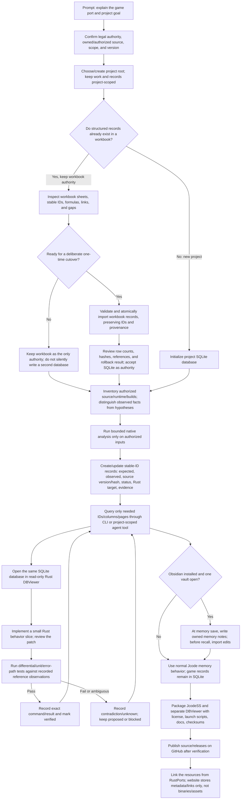

# Jcode database, spreadsheet migration, DBViewer, and Obsidian workflow

**Status: implementation guide for the current experimental Jcode SQLite workflow.** Check the version and release notes before using this with important project data. This method does not promise zero behavioral drift, automatic game reconstruction, legal clearance, or a fixed token saving.

## What is authoritative?

Use one writable authority per project's structured behavioral records:

- For a new port project, the current native workflow uses the project's SQLite file as its structured mapping/evidence database from the start.
- For a project whose records already live in an Excel workbook, keep that workbook authoritative until you explicitly run the validated one-time importer. After that reviewed migration, SQLite is authoritative. The importer records workbook provenance and does not edit or delete the workbook.
- Do not continue editing both the workbook and SQLite after cutover. That creates two authorities and permits drift. Keep the original workbook archived/read-only as historical evidence or keep editing it and do not cut over yet.
- Obsidian is an optional memory surface for Jcode's general/project memory, not a mirror of the structured game mapping database. It does not replace SQLite, evidence records, source control, or tests.

No generated Rust engine or decompiled source is promised. Jcode can help inspect authorized programs, read/update bounded database records, and support implementation/test work. Developers review generated patches and Rust code; behavior is accepted only after tests against evidence.

## Detailed flow



### What happens at each stage

1. **Scope and permission.** Identify the exact project and source version. Analyze only software you own, are authorized to test, or can lawfully study. Keep hypotheses labeled as hypotheses. This is engineering guidance, not legal advice.
2. **Project root.** Jcode resolves the database from the project context. By default it is `.jcode/project.sqlite3`. An optional `.jcode/database-location.toml` can choose another local path. CLI `--database PATH` explicitly overrides it. Missing database reads fail instead of silently creating a new source of truth. `jcode db init` is the explicit creation step and refuses to overwrite an existing file.
3. **Workbook path.** If a workbook is still authoritative, inspect it and continue editing only it. When choosing cutover, use `jcode db import-workbook --config jcode-workbook.toml`. Validation checks stable IDs, field structure, and references before transactional insertion. A failure rolls back. The workbook is not rewritten or erased. Review imported counts and provenance before you designate SQLite authoritative.
4. **SQLite record design.** Store compact structured facts keyed by stable ID. The conventional `reverse_engineering` record has fields such as `symbol`, `source_path`, `source_sha256`, `address`, `status`, `expected`, `observed`, `rust_target`, and `evidence`. Keep large binaries, game assets, captures, and logs out of the database and public resources. Store paths/hashes or authorized evidence references where appropriate.
5. **Targeted context.** Prefer `jcode db get reverse_engineering FN_PARSE_HEADER` or a bounded `rows` page over copying every workbook/database row into every prompt. Agent tool reads are project-scoped and bounded. This can reduce repeated context, but actual tokens depend on the provider, turn, retrieved records, and conversation. Measure provider usage rather than claiming a guaranteed multiplier.
6. **Analysis.** Native binary inspection can expose supported metadata, strings, and bounded disassembly. It is not an automatic decompiler, source recovery tool, or proof of behavior. Confirm observations on authorized reference builds and preserve the exact source/binary hash.
7. **Implementation and evidence.** Port small units. Compare expected and observed behavior with Rust tests for normal, boundary, malformed, and error cases. Record command, result, source version, and evidence. A stable ID or passing schema check alone does not prove behavioral parity.
8. **DBViewer.** `jcode db view` launches a separate Rust/egui DBViewer companion on the current project's database and selects `reverse_engineering`. `--table NAME` selects another table/view. The viewer is read-only for SQLite and shows the same records Jcode queries. F5 refreshes the selected page. If the executable is not alongside Jcode, set `JCODE_DBVIEWER`, provide `--viewer PATH`, or use explicit `--print-path` for manual handoff. Do not run two independently edited database copies.
9. **Obsidian memory.** If Obsidian is installed with exactly one open vault, Jcode detects it from its local registry. Jcode writes its memory records below `Jcode Memory/Global/` and `Jcode Memory/Projects/<project-key>/`. Jcode-owned notes are imported before the next memory recall; user edits are not processed while Jcode is idle or closed. This is boundary-triggered/near-real-time sync, not a background watcher. Other notes are ignored. Multiple open vaults require `JCODE_OBSIDIAN_VAULT` to select the intended vault. With no vault, ordinary Jcode memory behavior remains available.
10. **Packaging.** Distribute the Jcode binary and DBViewer as two executables in one versioned archive, with the DBViewer MIT notice, launcher scripts, install-local settings template, user guide, and SHA-256 manifest. Test a clean install in a temporary project and verify the actual GUI renders a page. Never claim tested GUI acceptance from a mocked process or compile alone.
11. **Sharing on RustPorts.** RustPorts is a moderated metadata directory. Its terms prohibit uploads of executables, archives, source, screenshots, and game assets. Keep source and versioned binary releases on GitHub. RustPorts Resources may link to the GitHub guide/release; the website itself is not a binary host. Game creators host their own servers and RustPorts does not relay traffic.

## Useful commands

Run these in a project that has the native Jcode CLI available:

```console
jcode db init
jcode db tables
jcode db rows reverse_engineering --limit 10
jcode db get reverse_engineering FN_PARSE_HEADER
jcode db view
jcode db view --table Requirements
```

For a legacy workbook only when ready to migrate:

```console
jcode db import-workbook --config jcode-workbook.toml
jcode db tables
jcode db rows reverse_engineering --limit 20
```

For a reviewed record update, read the latest record and use the returned hash as the optimistic-concurrency token:

```console
jcode db get reverse_engineering FN_PARSE_HEADER
```

Then pipe a compact JSON object into `jcode db put reverse_engineering FN_PARSE_HEADER --expected HASH`. Inserts do not overwrite stable IDs. Stale update hashes are rejected rather than silently clobbering another writer.

## Token efficiency and drift limits

The strongest savings mechanism is **not** to transmit all spreadsheet/database rows. Keep the project database local, retrieve only the stable IDs, requested columns, and bounded pages needed for a task, and record short evidence references instead of pasting large assets/logs. Reuse the same durable project records across turns. Provider-side token metering is the evidence for savings; Jcode cannot guarantee a percentage or eliminate the token cost of code, reasoning, or the current task prompt.

A single authority, stable IDs, hashes, validation, and tests make drift detectable and reduce accidental divergence. They do not make arbitrary code 100% drift-free. Direct Rust edits still require review and behavioral tests. If structured requirements change, update the authoritative database and rerun the tests that depend on them.

## Packaging/release checklist

- [ ] Confirm workbook-to-SQLite cutover decision and preserve the original workbook.
- [ ] Build Jcode and the separate DBViewer for the supported target.
- [ ] Run importer, CLI, agent-tool, memory-sync, and DBViewer tests.
- [ ] Install both binaries into a fresh test directory with license, scripts, and configuration templates.
- [ ] Launch `jcode db view` on an isolated fixture and verify the correct data page is visible.
- [ ] Verify Obsidian auto-detection, write, edit-import, no-vault behavior, and multiple-vault safety.
- [ ] Generate SHA-256 values and confirm archive contents contain no credentials, private project records, or game assets.
- [ ] Publish source and binaries in GitHub; link from RustPorts Resources only. Do not upload files to RustPorts.
- [ ] Include exact OS/tool versions, commands, tests, limitations, and known issues in release notes.
